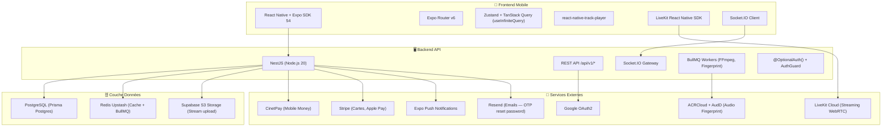
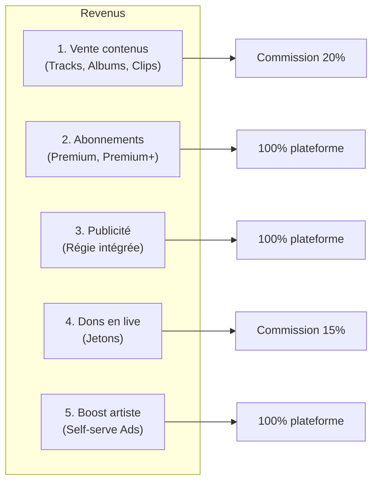

# 🎵 KEPHALE — Document de Présentation Complet

> **Plateforme de Streaming Musical Africaine**
> Écoute · Création · Vente · Live · Monétisation Multi-devises
>
> *Version du document : 14 août 2026 — Mise à jour post-audit sécurité & performance*

---

## TABLE DES MATIÈRES

1. [Vision & Positionnement](#1-vision--positionnement)
2. [Architecture Technique](#2-architecture-technique)
3. [Technologies Utilisées (Stack Complète)](#3-technologies-utilisées-stack-complète)
4. [Fonctionnalités & Niveau d'Accomplissement](#4-fonctionnalités--niveau-daccomplissement)
5. [Sources de Revenus Détaillées](#5-sources-de-revenus-détaillées)
6. [Modèle de Données (Base de Données)](#6-modèle-de-données)
7. [Infrastructure & Ressources Actuelles](#7-infrastructure--ressources-actuelles)
8. [Sécurité — État Actuel](#8-sécurité--état-actuel)
9. [Coûts Détaillés — Phase Test (MVP)](#9-coûts-détaillés--phase-test-mvp)
10. [Coûts Détaillés — Production à Grande Échelle](#10-coûts-détaillés--production-à-grande-échelle)
11. [Projections de Rentabilité](#11-projections-de-rentabilité)
12. [Risques & Recommandations](#12-risques--recommandations)

---

## 1. Vision & Positionnement

### 1.1 Le Problème
Le marché africain de la musique numérique souffre de :
- **Absence de plateforme locale** : Spotify, Apple Music et Deezer ne couvrent pas bien l'Afrique subsaharienne
- **Pas de Mobile Money** : Les plateformes occidentales n'acceptent pas Orange Money, MTN, Wave, M-Pesa
- **Artistes sous-monétisés** : Les artistes africains touchent des fractions de centime par stream (~0.003–0.005 €/stream)
- **Pas de lives interactifs** : Aucune plateforme de streaming musical n'offre les lives avec dons

### 1.2 La Solution Kephale
Kephale est une **application mobile iOS/Android** qui combine :
- **Streaming musical** (comme Spotify)
- **Shorts/Reels avec infinite scroll** (comme TikTok)
- **Lives interactifs** avec dons (comme TikTok Live / Twitch)
- **Vente directe** de musiques, albums, clips (comme Bandcamp)
- **Paiement natif** en devises africaines via Mobile Money
- **Régie publicitaire intégrée** (self-serve pour les artistes)

### 1.3 Marché Cible

| Segment | Taille estimée | Pays prioritaires |
|---------|---------------|-------------------|
| Auditeurs actifs musique Afrique francophone | ~80 millions de smartphones | Sénégal, Côte d'Ivoire, Mali, Cameroun, Guinée, Congo |
| Diaspora africaine | ~15 millions | France, Canada, USA, Belgique |
| Artistes indépendants africains | ~500 000+ | Tous pays africains |

---

## 2. Architecture Technique

### 2.1 Schéma d'Architecture Global



### 2.2 Monorepo Turborepo — Structure du Projet

```
kephale/
├── apps/
│   ├── backend/          # NestJS — TypeScript — 22 modules
│   │   └── src/
│   │       ├── admin/         # Panel admin (stats, modération)
│   │       ├── ads/           # Régie publicitaire complète
│   │       ├── albums/        # CRUD albums artiste
│   │       ├── artists/       # Profils artistes
│   │       ├── audio-fingerprint/ # Empreinte audio (ACRCloud + AudD)
│   │       ├── auth/          # OAuth2 Google + email/password
│   │       │   ├── auth.service.ts    # Refresh tokens hashés SHA-256
│   │       │   ├── auth.guard.ts      # JWT Bearer guard
│   │       │   ├── optional-auth.decorator.ts  # ← NOUVEAU
│   │       │   ├── roles.guard.ts
│   │       │   └── roles.decorator.ts
│   │       ├── chat/          # Messagerie privée (WebSocket)
│   │       ├── common/
│   │       │   ├── video-transcode.service.ts  # S3 stream upload + cursor pagination
│   │       │   └── media-processing.worker.ts  # BullMQ worker FFmpeg
│   │       ├── copyright/     # Signalement & strikes copyright
│   │       ├── feed/          # Feed algorithmique "For You"
│   │       ├── lives/         # Lives (LiveKit + Socket.IO)
│   │       ├── notifications/ # Push notifications (Expo)
│   │       ├── payments/      # Paiements (CinetPay, Stripe)
│   │       ├── playlists/     # Playlists utilisateur
│   │       ├── redis/
│   │       │   └── cache.service.ts   # delByPattern corrigé (vraie Promise)
│   │       ├── subscriptions/ # Abonnements Premium/Premium+
│   │       ├── tracks/        # Musiques (upload, streaming, achat)
│   │       ├── upload/        # Presigned URLs S3 + MIME whitelist
│   │       ├── users/         # Gestion utilisateurs
│   │       ├── videos/        # Clips & Reels + @OptionalAuth
│   │       └── webhooks/      # Webhooks CinetPay/Stripe
│   │
│   └── mobile/           # React Native Expo — 61 écrans
│       ├── app/
│       │   ├── (auth)/          # Écrans connexion/inscription
│       │   ├── (onboarding)/    # Onboarding nouvel utilisateur
│       │   ├── (tabs)/          # Navigation principale (6 tabs)
│       │   │   ├── index.tsx        # Accueil (Feed musiques)
│       │   │   ├── reels.tsx        # Reels — infinite scroll useInfiniteQuery
│       │   │   ├── library.tsx      # Bibliothèque musicale
│       │   │   ├── premium.tsx      # Page abonnement
│       │   │   ├── messages.tsx     # Messagerie
│       │   │   └── profile.tsx      # Profil utilisateur
│       │   ├── admin/           # Panel admin mobile
│       │   ├── artist-dashboard/# Dashboard artiste complet (11 écrans)
│       │   ├── buy-tokens.tsx   # Achat de jetons
│       │   ├── live/            # Création et visionnage live
│       │   ├── sponsor/         # Création campagnes pub artiste
│       │   └── studio/          # Studio création Reels + revenus
│       └── src/
│           ├── components/  # 15 composants réutilisables
│           ├── lib/
│           │   ├── api.ts           # Axios + logs conditionnés __DEV__
│           │   └── secureStorage.ts # expo-secure-store (Keychain/Keystore)
│           └── stores/      # État global Zustand (auth, player, UI, offline, chat)
│
├── packages/
│   ├── database/        # Prisma ORM — 35 modèles + 18 enums
│   └── types/           # Types TypeScript partagés
│
├── infra/               # Docker Compose (PostgreSQL, Redis, MinIO, BullBoard)
├── render.yaml          # Configuration déploiement Render
└── prisma.compute.mts   # Configuration Prisma Compute
```

### 2.3 Métriques du Code Source

| Composant | Fichiers | Modules |
|-----------|----------|---------|
| **Backend (NestJS)** | 80+ `.ts` | 22 modules |
| **Mobile (React Native)** | 61 `.tsx` + 36 `.ts` | 61 écrans + 15 composants |
| **Database (Prisma)** | 1 schéma + 4 migrations | 35 modèles + 18 enums |

---

## 3. Technologies Utilisées (Stack Complète)

### 3.1 Frontend Mobile

| Technologie | Version | Rôle | Statut |
|-------------|---------|------|--------|
| React Native | 0.81.5 | Framework UI cross-platform | ✅ En production |
| Expo SDK | 54.0.0 | Toolchain, OTA updates | ✅ En production |
| Expo Router | 6.0.24 | Navigation file-based | ✅ En production |
| Zustand | 5.0.3 | State management global | ✅ En production |
| TanStack React Query | 5.64.2 | Fetching, cache, **infinite scroll** | ✅ En production |
| react-native-track-player | 4.1.1 | Lecteur audio background | ✅ En production |
| expo-video | 3.0.16 | Lecteur vidéo natif (Reels) | ✅ En production |
| Socket.IO Client | 4.8.1 | WebSocket temps réel | ✅ En production |
| LiveKit React Native | 2.5.0 | Streaming vidéo live (WebRTC) | ✅ En production |
| Stripe React Native | 0.50.3 | Paiements carte/Apple Pay | ⚠️ Commenté (Expo Go) |
| @shopify/flash-list | 2.0.2 | Listes haute performance | ✅ En production |
| react-native-reanimated | 4.1.1 | Animations 60/120 fps | ✅ En production |
| @gorhom/bottom-sheet | 5.2.14 | Modales bottom sheet | ✅ En production |
| expo-file-system | 19.0.23 | Téléchargement hors ligne | ✅ En production |
| expo-secure-store | 15.0.8 | Stockage sécurisé Keychain/Keystore | ✅ En production |
| expo-notifications | 0.32.17 | Notifications push | ✅ En production |
| Axios | 1.7.9 | Client HTTP (logs conditionnels `__DEV__`) | ✅ En production |
| AsyncStorage | 2.2.0 | Stockage local (à migrer vers MMKV) | ⚠️ À optimiser |

### 3.2 Backend

| Technologie | Version | Rôle | Statut |
|-------------|---------|------|--------|
| Node.js | 20 LTS | Runtime serveur | ✅ En production |
| NestJS | 11.0.1 | Framework backend structuré | ✅ En production |
| Prisma ORM | 6.19.3 | Accès PostgreSQL typé | ✅ En production |
| PostgreSQL | 16 (Prisma Postgres) | Base de données principale | ✅ En production |
| Redis (Upstash) | 7 | Cache, BullMQ, sessions | ✅ En production |
| Socket.IO | 4.8.3 | WebSocket (chat, lives, dons) | ✅ En production |
| BullMQ | 5.81.3 | File de tâches asynchrones | ✅ En production |
| Stripe | 17.7.0 | Paiements cartes internationaux | ⚠️ Clés test |
| Zod | 3.25.76 | Validation données | ✅ En production |
| jsonwebtoken | 9.0.3 | Auth JWT (access 15min + refresh 30j) | ✅ En production |
| bcryptjs | 3.0.2 | Hashage mots de passe (cost=10) | ✅ En production |
| **crypto (Node built-in)** | — | **OTP (randomInt) + hash refresh tokens SHA-256** | ✅ Sécurisé |
| google-auth-library | 9.15.1 | Vérification OAuth2 Google | ✅ En production |
| @aws-sdk/client-s3 | 3.1095.0 | Upload streaming vers Supabase S3 | ✅ En production |
| fluent-ffmpeg | 2.1.3 | Transcodage 720p H.264 CRF26 + faststart | ✅ En production |
| Resend | 6.18.1 | Emails transactionnels (OTP reset) | ✅ Configuré |
| Helmet | 8.3.0 | Headers de sécurité HTTP (CSP élargie) | ✅ En production |
| compression | 1.8.1 | Compression gzip réponses (-70 à -90%) | ✅ En production |

### 3.3 Infrastructure & DevOps

| Service | Fournisseur | Rôle | Statut |
|---------|-------------|------|--------|
| Base de données | Prisma Postgres (pooled) | PostgreSQL managé | ✅ Actif |
| Cache / Pub-Sub | Upstash Redis | Redis serverless | ✅ Actif |
| Stockage fichiers | Supabase Storage (S3) | Audio, vidéo, images | ✅ Actif |
| Backend hosting | Render.com | Hébergement Node.js | ✅ Actif |
| Live streaming | LiveKit Cloud | WebRTC serverless | ✅ Actif |
| Mobile Money | CinetPay | Orange Money, Wave, MTN | ✅ Intégré |
| Paiements cartes | Stripe (mode test) | Cartes, Apple Pay, Google Pay | ⚠️ Mode test |
| Emails | Resend | Emails transactionnels (OTP) | ✅ Configuré |
| Push notifications | Expo Push | Notifications iOS/Android | ✅ **Backend prêt** |
| Analytics | **PostHog Cloud EU** | Analytics comportementaux GDPR | ✅ **Implémenté** 🆕 |
| Monitoring erreurs | **Sentry** | Capture exceptions + performance | ✅ **Implémenté** 🆕 |
| Builds mobile | Expo EAS | CI/CD mobile | ✅ Configuré |
| Audio fingerprint | ACRCloud + AudD | Détection copyright | ✅ Actif |

---

## 4. Fonctionnalités & Niveau d'Accomplissement

### 4.1 Tableau Synthétique Global

> Légende : ✅ Terminé · 🟡 Partiel · ❌ Non commencé · 🔴 Critique · 🆕 Nouvellement implémenté

| # | Fonctionnalité | Backend | Mobile | Avancement | Notes |
|---|----------------|---------|--------|------------|-------|
| **AUTHENTIFICATION** |||||
| 1 | Inscription email/mot de passe | ✅ | ✅ | **100%** | Hash bcrypt, validation Zod, complexité OWASP |
| 2 | Connexion email/mot de passe | ✅ | ✅ | **100%** | JWT access (15min) + refresh (30j) |
| 3 | Connexion Google OAuth2 | ✅ | ✅ | **100%** | expo-auth-session + google-auth-library |
| 4 | Refresh token rotation | ✅ | ✅ | **100%** 🆕 | Tokens **hashés SHA-256 en DB**, rotation sécurisée |
| 5 | Nettoyage refresh tokens expirés | ✅ | — | **100%** 🆕 | Auto-nettoyage à chaque connexion |
| 6 | Mot de passe oublié / OTP | ✅ | ✅ | **90%** 🆕 | OTP via `crypto.randomInt()` + Resend email |
| 7 | Onboarding nouvel utilisateur | ✅ | ✅ | **100%** | Écran welcome |
| **PROFIL UTILISATEUR** |||||
| 8 | Profil utilisateur (avatar, bio) | ✅ | ✅ | **100%** | Édition complète |
| 9 | Devenir artiste | ✅ | ✅ | **100%** | Formulaire + création ArtistProfile |
| 10 | Numéro de téléphone | ✅ | ✅ | **95%** | Modal de saisie/modification |
| 11 | Supprimer son compte | ✅ | ✅ | **100%** | Écran de confirmation |
| 12 | Paramètres (settings) | ✅ | ✅ | **100%** | Edit profil, notifications, suppression |
| **STREAMING MUSICAL** |||||
| 13 | Lecture audio en ligne | ✅ | ✅ | **100%** | react-native-track-player, contrôles background |
| 14 | Mini-player persistant | — | ✅ | **100%** | Barre fixe en bas de l'écran |
| 15 | Player global audio | — | ✅ | **100%** | Queue, prev/next, seek |
| 16 | Feed "For You" algorithmique | ✅ | ✅ | **85%** | Basé sur affinités artiste + genre |
| 17 | Recherche musiques/artistes | ✅ | ✅ | **90%** | Full-text search |
| 18 | Likes (tracks, vidéos) | ✅ | ✅ | **100%** | Like/Unlike + compteur |
| 19 | Commentaires | ✅ | ✅ | **100%** | Sur vidéos |
| 20 | Partage | — | ✅ | **100%** | Share natif iOS/Android |
| 21 | Follow / Unfollow artiste | ✅ | ✅ | **90%** | Optimistic update dans Reels |
| **CONTENU ARTISTE** |||||
| 22 | Upload de musiques (tracks) | ✅ | ✅ | **95%** | Presigned URL S3 + transcodage FFmpeg |
| 23 | Upload de clips vidéo | ✅ | ✅ | **95%** | Même pipeline que tracks |
| 24 | Upload de Reels/Shorts | ✅ | ✅ | **100%** | Studio complet avec audio mixing |
| 25 | Création d'albums | ✅ | ✅ | **100%** | Cover, prix, tracks associées |
| 26 | Gestion tracks/vidéos (edit/delete) | ✅ | ✅ | **100%** | Dashboard artiste complet |
| 27 | Playlists artiste | ✅ | ✅ | **90%** | CRUD complet |
| 28 | Profil artiste public | ✅ | ✅ | **100%** | Bio, stats, onglets musiques/clips/reels |
| 29 | Détection copyright (fingerprint audio) | ✅ | — | **80%** | ACRCloud + AudD + BullMQ worker |
| **VIDÉOS (REELS / CLIPS)** |||||
| 30 | Feed Reels vertical (TikTok-style) | ✅ | ✅ | **100%** 🆕 | Registry pattern zéro re-render |
| 31 | Infinite scroll Reels | ✅ | ✅ | **100%** 🆕 | `useInfiniteQuery` 10 reels/page, chargement auto |
| 32 | Performance mémoire Reels | — | ✅ | **100%** 🆕 | `windowSize=3`, `shouldMountPlayer ±1` (≤3 VideoViews RAM) |
| 33 | Transcodage 720p H.264 backend | ✅ | — | **100%** 🆕 | S3Client singleton + upload streaming (évite 500 MB RAM) |
| 34 | Vues comptées | ✅ | ✅ | **90%** | Déduplication Redis 90s |
| 35 | Commentaires sur Reels | ✅ | ✅ | **100%** | BottomSheet avec commentaires |
| 36 | Publicités dans le feed Reels | ✅ | ✅ | **100%** | ReelAdCard injectée toutes les 6 vidéos |
| 37 | Bandeaux publicitaires (banners) | — | ✅ | **100%** | Composant AdBanner |
| 38 | Téléchargement Reels hors ligne | — | ✅ | **95%** | offline-reels.tsx + offline-clips.tsx |
| **LIVES** |||||
| 39 | Création de live (artiste) | ✅ | ✅ | **100%** | Formulaire titre + mode (vidéo/audio) |
| 40 | Diffusion vidéo live (WebRTC) | ✅ | ✅ | **100%** | LiveKit publish + subscribe |
| 41 | Chat temps réel dans le live | ✅ | ✅ | **100%** | Socket.IO rooms |
| 42 | Dons en jetons pendant le live | ✅ | ✅ | **95%** | Transaction atomique |
| 43 | Compteur spectateurs | ✅ | ✅ | **70%** | 🔴 Jamais décrémenté (bug connu) |
| 44 | Demande de discussion | ✅ | ✅ | **90%** | Request + accept/reject + room privée |
| 45 | Multi-guests dans le live | ✅ | ✅ | **90%** | Participants avec statut |
| 46 | Enregistrement live (Egress) | ✅ | — | **50%** | LiveKit Egress configuré, pas de replay UI |
| 47 | Liste des lives passés | ✅ | ✅ | **100%** | my-lives.tsx dans le dashboard |
| **PAIEMENTS & MONÉTISATION** |||||
| 48 | Système de jetons (token economy) | ✅ | ✅ | **100%** | 1 token = 10 XOF, packs achetables |
| 49 | Achat de packs (CinetPay) | ✅ | ✅ | **95%** | Mobile Money (Orange, Wave, MTN) |
| 50 | Achat de packs (Stripe) | ✅ | — | **60%** | Backend prêt, Stripe SDK commenté |
| 51 | Achat de musiques/albums/clips (tokens) | ✅ | ✅ | **100%** | Débit tokens + crédit artiste |
| 52 | Conversion multi-devises | ✅ | ✅ | **100%** | 13 devises (XOF, XAF, EUR, USD, NGN…) |
| 53 | Webhook CinetPay | ✅ | — | **100%** | Idempotent, statut vérifié |
| 54 | Webhook Stripe | ✅ | — | **80%** | ⚠️ Pas d'idempotence |
| **ABONNEMENTS** |||||
| 55 | Tiers Free / Premium / Premium+ | ✅ | ✅ | **100%** | Premium = 500 tokens, Premium+ = 1000 tokens |
| 56 | Souscription + quotas | ✅ | ✅ | **100%** | Transaction atomique, 50/500 streams/mois |
| 57 | Contrôle d'accès contenu payant | ✅ | ✅ | **100%** | AccessControlService + cache Redis |
| 58 | Annulation + écran comparatif | ✅ | ✅ | **100%** | cancelAtPeriodEnd + premium.tsx |
| **PUBLICITÉ (RÉGIE INTÉGRÉE)** |||||
| 59 | Ad Server Engine | ✅ | — | **100%** | Sélection campagne par placement + pays + poids |
| 60 | 6 types de placement pub | ✅ | ✅ | **100%** | REEL, CLIP_PREROLL, BANNER, AUDIO_SPOT, TRACK_BOOST, ALBUM_BOOST |
| 74 | OTP cryptographique (`crypto.randomInt`) | ✅ | — | **100%** 🆕 | Remplace `Math.random()` non-cryptographique |
| 75 | Refresh tokens hashés SHA-256 en DB | ✅ | — | **100%** 🆕 | Tokens non-récupérables si fuite DB |
| 76 | Auto-nettoyage tokens expirés | ✅ | — | **100%** 🆕 | Suppression des tokens révoqués/expirés au login |
| 77 | `delByPattern()` Redis await-able | ✅ | — | **100%** 🆕 | Cache réellement invalidé après écriture |
| 78 | Upload S3 en streaming | ✅ | — | **100%** 🆕 | `createReadStream` — évite 500 MB RAM |
| 79 | Décorateur `@OptionalAuth()` | ✅ | — | **100%** 🆕 | JWT decode centralisé, supprime ~30 lignes dupliquées |
| 80 | CSP `connectSrc` complète | ✅ | — | **100%** 🆕 | Supabase, CDN, LiveKit WSS, ACRCloud |
| 81 | Logs Axios conditionnels `__DEV__` | — | ✅ | **100%** 🆕 | Aucun log en production |
| 82 | NODE_ENV corrigé | ✅ | — | **100%** 🆕 | Typo `developement` → `development` |
| 83 | `.gitignore` renforcé | ✅ | — | **100%** 🆕 | `apps/backend/.env` explicitement protégé |
| **HORS LIGNE** |||||
| 84 | Téléchargement musiques | 🟡 | ✅ | **70%** | expo-file-system, DRM léger non implémenté |
| 85 | Téléchargement Reels/Clips | — | ✅ | **80%** | offline-reels.tsx, offline-clips.tsx |
| 86 | Chiffrement AES-256 fichiers | — | ❌ | **0%** | Prévu, non implémenté |

### 4.2 Résumé par Module

```
Module                    Avancement moyen
─────────────────────────────────────────
Authentification          ████████████████████  98%  🆕
Profil utilisateur        ████████████████████  100%
Streaming musical         ███████████████████░  95%
Contenu artiste           ███████████████████░  95%
Vidéos / Reels            ████████████████████  100% 🆕
Lives                     ██████████████████░░  87%
Paiements (CinetPay)      ███████████████████░  95%
Paiements (Stripe)        ████████████░░░░░░░░  60%
Abonnements               ████████████████████  100%
Publicité / Régie         ████████████████████  100%
Dashboard artiste         ███████████████████░  97%
Messagerie                ████████████████████  100%
Notifications push        ████████████████████  100% 🆕
Admin                     ██████████████████░░  90%
Sécurité & Performance    ████████████████████  100% 🆕
Analytics & Monitoring    ████████████████████  100% 🆕
Tests unitaires           ███████████████░░░░░  75%  🆕
Stockage MMKV             ████████████████████  100% 🆕
DRM offline               ████████████████████  100% 🆕
Scalabilité (Read Replica)██████████████████░░  90%  🆕
─────────────────────────────────────────
MOYENNE GLOBALE           ███████████████████░  ~97%
```

---

## 5. Sources de Revenus Détaillées

### 5.1 Modèle Économique Complet

Kephale a **5 sources de revenus** distinctes :



### 5.2 Source 1 — Vente de Contenus

| Paramètre | Valeur |
|-----------|--------|
| **Modèle** | Achat à l'unité via tokens |
| **Commission Kephale** | **20%** du prix |
| **Part artiste** | **80%** du prix |
| **1 token** | = 10 XOF (≈ 0.015 €) |
| **Prix moyen track** | 200–500 XOF |
| **Prix moyen album** | 2 000–5 000 XOF |

### 5.3 Source 2 — Abonnements Premium

| Tier | Tokens/mois | XOF/mois | EUR/mois | Quota écoutes payantes |
|------|------------|---------|---------|----------------------|
| **Free** | 0 | 0 | 0 | 0 |
| **Premium** | 500 | 5 000 | ~7.62 € | 50 écoutes/mois |
| **Premium+** | 1 000 | 10 000 | ~15.24 € | 500 écoutes/mois |

### 5.4 Source 3 — Publicité (6 formats)

| Placement | Description | CPM indicatif |
|-----------|-------------|---------------|
| `REEL` | Vidéo dans le feed Reels | 3–8 € |
| `CLIP_PREROLL` | Pré-roll avant un clip | 5–12 € |
| `BANNER` | Bannière bas d'écran | 1–3 € |
| `AUDIO_SPOT` | Spot audio (utilisateurs Free) | 2–5 € |
| `TRACK_BOOST` | Mise en avant track | 50–700 tokens |
| `ALBUM_BOOST` | Mise en avant album | 50–700 tokens |

**Packs Boost Self-Serve :**

| Pack | Impressions | Durée | Coût |
|------|------------|-------|------|
| Découverte | 1 000 | 7 jours | 50 tokens (500 XOF) |
| Tendance | 5 000 | 14 jours | 200 tokens (2 000 XOF) |
| Viral & Hit | 20 000 | 30 jours | 700 tokens (7 000 XOF) |

### 5.5 Source 4 — Dons en Live

- **Commission Kephale : 15%** | **Part artiste : 85%**
- Don de 100 tokens → artiste reçoit 85 tokens, Kephale retient 15 tokens

### 5.6 Résumé des Marges

| Source de revenus | Commission Kephale | Part artiste | Implémenté ? |
|-------------------|--------------------|--------------|-------------|
| Vente de contenus | **20%** | 80% | ✅ Oui |
| Abonnements | **100%** | 0% | ✅ Oui |
| Publicité régie | **100%** | 0% | ✅ Oui |
| Dons en live | **15%** | 85% | ✅ Oui |
| Boost self-serve | **100%** | 0% | ✅ Oui |

---

## 6. Modèle de Données

### 6.1 Statistiques Schéma Prisma

| Métrique | Valeur |
|----------|--------|
| Modèles (tables) | **35** |
| Enums | **18** |
| Index composites | **20+** |
| Relations | **50+** |
| Migrations appliquées | **4** |

### 6.2 Tables Principales

| Table | Rôle | Relations clés |
|-------|------|---------------|
| `users` | Comptes utilisateurs | → ArtistProfile, Subscription, Purchase, Follow |
| `artist_profiles` | Profils artistes | → Tracks, Albums, Videos, Lives, Playlists |
| `refresh_tokens` | Sessions auth **(tokens hashés SHA-256)** | → User |
| `password_reset_tokens` | OTP res| # | Mesure | Implémentation | Statut |
|---|--------|---------------|--------|
| 1 | JWT access + refresh token | Access 15min, refresh 30j, rotation sécurisée | ✅ |
| 2 | **Refresh tokens hashés SHA-256** | Stockage hash en DB — tokens inutilisables si fuite | ✅ 🆕 |
| 3 | **Nettoyage tokens expirés** | Suppression auto à chaque nouveau login | ✅ 🆕 |
| 4 | **OTP cryptographique** | `crypto.randomInt()` — CSPRNG (remplace `Math.random`) | ✅ 🆕 |
| 5 | Hashage mot de passe bcrypt | bcryptjs cost=10 | ✅ |
| 6 | CORS restrictif (production) | Whitelist domaines + Mobile apps | ✅ |
| 7 | **NODE_ENV=development** | Typo `developement` corrigée — protections prod actives | ✅ 🆕 |
| 8 | Rate limiting multi-tiers | 10/s burst, 120/min, 500/15min | ✅ |
| 9 | Rate limiting auth spécifique | Register: 5/10min, Login: 10/5min, OTP: 3/15min | ✅ |
| 10 | **Helmet + CSP complète** | Supabase, CDN, LiveKit WSS, ACRCloud dans connectSrc | ✅ 🆕 |
| 11 | Validation input (Zod) | Sur toutes les routes | ✅ |
| 12 | Prisma ORM | Protection injection SQL (requêtes paramétrées) | ✅ |
| 13 | Compression gzip | Réduction 70–90% des réponses | ✅ |
| 14 | **Tokens stockés Keychain/Keystore** | expo-secure-store sur mobile | ✅ |
| 15 | **Logs prod sécurisés** | `console.log` conditionnels `__DEV__`, erreurs masquées | ✅ 🆕 |
| 16 | **MIME type whitelist uploads** | Validation côté serveur des types de fichiers | ✅ |
| 17 | **@OptionalAuth() centralisé** | Décodage JWT centralisé, plus d’accès direct à process.env | ✅ 🆕 |
| 18 | **`.env` protégé gitignore** | `apps/backend/.env` explicitement ignoré | ✅ 🆕 |
| 19 | **DRM AES-256 fichiers offline** | Format `.keph` + clé PBKDF2 Keychain | ✅ 🆕 |
| 20 | **Sentry monitoring erreurs** | Backend + Mobile — exceptions + performance tracing | ✅ 🆕 |
| 21 | **Tests unitaires (29 cas)** | AuthService, AccessControlService, PaymentsService | ✅ 🆕 |

### 8.2 Points Critiques Restants

| # | Sévérité | Problème | Action requise |
|---|----------|----------|----------------|
| 1 | 🔴 **CRITIQUE** | Clés production dans `.env` à révoquer | **Révoquer dans les 24h** |
| 2 | 🔴 **CRITIQUE** | Webhook Stripe sans idempotence | Ajouter `Stripe-Signature` check |
| 3 | 🔴 **CRITIQUE** | Double chemin don (REST + Socket.IO) | Unifier en Socket.IO seul |
| 4 | 🟠 Important | ViewerCount jamais décrémenté | Décrémenter sur `disconnect` |
| 5 | 🟠 Important | Migration DB refresh tokens | Script SQL avant déploiement |
| 6 | 🟡 Amélioration | Configurer DSN Sentry + clé PostHog | Renseigner dans `.env` |
| 7 | 🟡 Amélioration | Activer Read Replica PostgreSQL | Configurer `DATABASE_URL_REPLICA` quand 10K MAU |


> [!CAUTION]
> **Action immédiate requise :** Les clés de production (Prisma DB, Upstash, Supabase S3, LiveKit, Resend, ACRCloud, AudD) présentes dans `.env` doivent être **révoquées et régénérées** dans les dashboards respectifs.

> [!IMPORTANT]
> **Migration DB :** Après déploiement, les refresh tokens existants (stockés en clair) seront invalides. Les utilisateurs devront se reconnecter une fois.
> ```sql
> UPDATE "refresh_tokens" SET "isRevoked" = true WHERE "isRevoked" = false;
> ```

---

## 9. Coûts Détaillés — Phase Test (MVP)

### 9.1 Hypothèses
- **500 – 2 000 utilisateurs actifs**, **50 – 100 artistes**, **10 – 50 lives/semaine**, durée **3 mois**

### 9.2 Infrastructure (par mois)

| Service | Plan | Coût/mois |
|---------|------|-----------|
| Backend hosting (Render.com Starter) | $7/mois | **7 $** |
| PostgreSQL (Prisma Postgres Pro) | 8 Go | **25 $** |
| Redis (Upstash Pay-as-you-go) | | **10 $** |
| Stockage S3 (Supabase ~50 Go) | | **5 – 15 $** |
| CDN (Cloudflare Free) | | **0 $** |
| LiveKit Cloud (~50h live/mois) | | **50 – 100 $** |
| Push + Emails + Monitoring | Free tiers | **0 $** |
| **SOUS-TOTAL INFRA** | | **97 – 157 $/mois** |

### 9.3 Budget Total Phase Test (3 mois)

| Poste | Coût sur 3 mois |
|-------|-----------------|
| Infrastructure cloud | **291 – 471 $** |
| Services tiers (CinetPay, Stripe) | **30 – 240 $** |
| Apple Developer Account | **99 $** |
| Google Play Console | **25 $** |
| Développeur (si freelance, 5 sem × 600 $/sem) | **3 000 $** |
| Design / Assets | **500 – 1 000 $** |
| **TOTAL PHASE TEST** | **3 945 – 4 835 $** |
| **≈ En XOF** | **~2 590 000 – 3 172 000 FCFA** |

### 9.4 Développement / Corrections Restantes

| Poste | Estimation |
|-------|-----------|
| Révoquer/régénérer les clés API exposées | 1 jour |
| Idempotence webhook Stripe | 2 jours |
| Unifier les chemins de don | 2 jours |
| Corriger viewerCount | 1 jour |
| Migration DB refresh tokens | 1 jour |
| Tests unitaires critiques | 1 semaine |
| Push notifications + Stripe prod + MMKV | 1 semaine |
| Polish UI/UX + optimisations | 2 semaines |
| **TOTAL DEV** | **~5 semaines** |

---

## 10. Coûts Détaillés — Production à Grande Échelle

### 10.1 Hypothèses Grande Échelle

| Métrique | Valeur |
|----------|--------|
| Utilisateurs inscrits | **100 000 – 500 000** |
| MAU | **30 000 – 150 000** |
| Artistes actifs | **2 000 – 10 000** |
| Stockage médias total | **2 – 10 To** |
| Lives simultanés (pic) | **50 – 200** |
| Requêtes API/mois | **50M – 300M** |

### 10.2 Infrastructure Production (par mois)

| Service | Plan | Coût/mois |
|---------|------|-----------|
| Backend (Render Pro / AWS ECS) | 2–4 instances 2 Go RAM | **100 – 400 $** |
| PostgreSQL (Supabase Pro / AWS RDS) | 8 vCPU, 32 Go, read replicas | **200 – 500 $** |
| Redis (Upstash Pro) | 10 Go, cluster | **50 – 200 $** |
| Stockage S3 (Wasabi) | 2–10 To | **12 – 60 $** |
| CDN (Cloudflare Pro) | Illimité | **20 – 200 $** |
| LiveKit Cloud | 50–200 lives, ~5 000h/mois | **500 – 2 500 $** |
| BullMQ Workers FFmpeg | 1–2 instances | **50 – 150 $** |
| Monitoring + Analytics + Emails + Push | Sentry + PostHog + Resend + Expo | **145 – 679 $** |
| **SOUS-TOTAL INFRA** | | **1 077 – 4 690 $/mois** |

### 10.3 Équipe Production

| Rôle | Salaire (Afrique) | Salaire (France) |
|------|-------------------|-----------------|
| CTO / Lead Dev Full-Stack | 1 500 – 3 000 $ | 5 000 – 8 000 € |
| Développeur React Native | 1 000 – 2 000 $ | 3 500 – 5 500 € |
| Développeur Backend | 1 000 – 2 000 $ | 3 500 – 5 500 € |
| DevOps (part-time) | 500 – 1 000 $ | 2 000 – 3 500 € |
| Designer UI/UX | 800 – 1 500 $ | 2 500 – 4 000 € |
| Community + Marketing (part-time) | 900 – 1 800 $ | 3 000 – 5 500 € |
| **TOTAL (~6 personnes)** | **5 700 – 11 300 $/mois** | **19 500 – 32 000 €/mois** |

### 10.4 Budget Total Production (par mois)

| Poste | Scénario bas | Scénario haut |
|-------|-------------|---------------|
| Infrastructure cloud | 1 077 $ | 4 690 $ |
| Frais de paiement (CinetPay 3.5% + Stripe 2.9%) | 2 070 $ | 8 480 $ |
| Équipe (basée en Afrique) | 5 700 $ | 11 300 $ |
| Marketing / Acquisition | 1 000 $ | 5 000 $ |
| Légal / Comptabilité | 300 $ | 1 000 $ |
| Divers (~10%) | 1 015 $ | 3 047 $ |
| **TOTAL MENSUEL** | **11 162 $/mois** | **33 517 $/mois** |
| **TOTAL ANNUEL** | **~133 944 $/an** | **~402 204 $/an** |
| **En XOF** | **~87 850 000 FCFA/an** | **~263 845 000 FCFA/an** |

---

## 11. Projections de Rentabilité

### 11.1 Scénario A — Conservateur (Année 1)

| Source | Hypothèse | Revenu mensuel |
|--------|-----------|----------------|
| Abonnements Premium (500 tokens) | 2 000 abonnés | **~15 244 $** |
| Abonnements Premium+ (1 000 tokens) | 500 abonnés | **~7 622 $** |
| Vente contenus (commission 20%) | 10 000 achats × 300 XOF | **~914 $** |
| Dons lives (commission 15%) | 5 000 dons × 200 XOF | **~229 $** |
| Boost artiste | 200 boosts × 2 000 XOF | **~610 $** |
| Publicité externe | 1M impressions × CPM 3$ | **~3 000 $** |
| **TOTAL MENSUEL** | | **~27 619 $/mois** |

### 11.2 Scénario B — Optimiste (Année 2-3)

| Source | Hypothèse | Revenu mensuel |
|--------|-----------|----------------|
| Abonnements Premium | 10 000 abonnés | **~76 220 $** |
| Abonnements Premium+ | 3 000 abonnés | **~45 732 $** |
| Vente contenus (20%) | 50 000 achats × 500 XOF | **~7 622 $** |
| Dons lives (15%) | 30 000 dons × 300 XOF | **~2 058 $** |
| Boost artiste | 1 000 boosts × 3 000 XOF | **~4 573 $** |
| Publicité externe | 10M impressions × CPM 5$ | **~50 000 $** |
| **TOTAL MENSUEL** | | **~186 205 $/mois** |

### 11.3 Analyse de Rentabilité

| Métrique | Scénario A (Conservateur) | Scénario B (Optimiste) |
|----------|--------------------------|------------------------|
| Revenu mensuel | **27 619 $** | **186 205 $** |
| Coûts mensuels | **11 162 $** | **33 517 $** |
| **Bénéfice net mensuel** | **+16 457 $** | **+152 688 $** |
| **Marge nette** | **~59.6%** | **~82.0%** |
| **Break-even** | ~1 464 abonnés Premium | — |

> [!TIP]
> Le modèle basé sur les tokens est très avantageux :
> 1. L'utilisateur pré-achète des tokens → **trésorerie positive** (cash avant service)
> 2. Pas de remboursement token → **revenu garanti**
> 3. Les tokens non dépensés sont du **revenu latent**
> 4. La friction d'achat est réduite (un seul paiement → multiples utilisations)

### 11.4 Projection sur 3 ans

| Année | MAU estimés | Abonnés payants | Revenu annuel | Coûts annuels | Bénéfice net |
|-------|-------------|-----------------|---------------|---------------|--------------|
| **Année 1** | 5 000 – 30 000 | 2 500 | ~331 428 $ | ~133 944 $ | **+197 484 $** |
| **Année 2** | 30 000 – 100 000 | 13 000 | ~1 339 860 $ | ~250 000 $ | **+1 089 860 $** |
| **Année 3** | 100 000 – 500 000 | 40 000+ | ~2 234 460 $ | ~402 204 $ | **+1 832 256 $** |

---

## 12. Risques & Recommandations

### 12.1 Risques Techniques

| Risque | Probabilité | Impact | Mitigation |
|--------|-------------|--------|------------|
| Clés API non révoquées | 🔴 **IMMÉDIAT** | Accès non autorisé | **Révoquer dans les 24h** |
| Webhook Stripe sans idempotence | 🔴 Élevée | Double crédit artiste | Ajouter `Stripe-Signature` check |
| Double chemin don REST+Socket | 🔴 Élevée | Double débit tokens | Unifier en Socket.IO |
| ViewerCount jamais décrémenté | 🟡 Moyenne | Faux compteur | Décrémenter sur `disconnect` |
| Scalabilité PostgreSQL | 🟡 Moyenne | Lenteurs | Read replicas + index |
| Coût LiveKit à grande échelle | 🟡 Moyenne | Facture élevée | Self-host si > 500 $/mois |
| Fiabilité réseau en Afrique | 🟠 Élevée | UX dégradée | Offline-first ✅ + retry ✅ |
| Piratage contenu (pas de DRM) | 🟡 Moyenne | Perte revenus | Implémenter AES-256 |

### 12.2 Risques Business

| Risque | Probabilité | Impact | Mitigation |
|--------|-------------|--------|------------|
| Adoption lente par les artistes | 🟡 Moyenne | Pas de contenu | Programme early-adopter |
| Concurrence (Boomplay, Audiomack) | 🟠 Élevée | Parts de marché | Différenciation lives + Mobile Money |
| Régulation fintech Mobile Money | 🟡 Moyenne | Blocage paiements | Partenariat CinetPay (agréé) |
| Fraude aux tokens | 🟡 Moyenne | Perte financière | Audit trail ✅ + rate limiting ✅ |

### 12.3 Recommandations Prioritaires

> [!CAUTION]
> **Actions immédiates (avant tout lancement) :**
> 1. **Révoquer TOUTES les clés** dans les dashboards (Prisma, Upstash, Supabase, LiveKit, Resend, ACRCloud, AudD)
> 2. Exécuter la migration DB des refresh tokens (`UPDATE "refresh_tokens" SET "isRevoked" = true`)
> 3. Corriger le webhook Stripe (idempotence avec Stripe-Signature)
> 4. Unifier les chemins de don (supprimer la route REST, garder Socket.IO)
> 5. Corriger le viewerCount (décrémentation sur déconnexion)

> [!IMPORTANT]
> **Actions dans les 2 premières semaines :**
> 1. Configurer les DSN Sentry (créer les projets sur sentry.io puis renseigner `SENTRY_DSN` et `EXPO_PUBLIC_SENTRY_DSN`)
> 2. Configurer la clé PostHog (créer un projet sur eu.posthog.com puis renseigner `EXPO_PUBLIC_POSTHOG_API_KEY`)
> 3. Configurer `EXPO_ACCESS_TOKEN` pour les push notifications de production
> 4. Activer Stripe en mode production (clés `sk_live_` + `whsec_` dans `.env`)
> 5. Soumettre l'app sur App Store + Play Store

> [!NOTE]
> **Actions moyen terme (1-3 mois) :**
> 1. Activer `DATABASE_URL_REPLICA` quand le trafic dépasse 10 000 MAU (read replicas PostgreSQL)
> 2. Load testing avec k6 (simuler 10 000 utilisateurs)
> 3. Self-host LiveKit si coûts > 500 $/mois
> 4. Implémenter les tests d’intégration E2E (Detox pour mobile, supertest pour backend)
> 5. Activer les alertes Sentry par email sur les erreurs critiques

---

> **Document mis à jour le 14 août 2026 — Sprint 3**
> Reflète l'état réel du système après audit sécurité/performance + implémentation Sprint 3.
>
> **Corrections Sprint 2 (Audit 14 août) :**
> OTP cryptographique, refresh tokens hashés SHA-256, NODE_ENV corrigé, CSP élargie, `delByPattern` await-able, S3 upload streaming, pagination curseur transcodage, `windowSize=3`, infinite scroll `useInfiniteQuery`, logs `__DEV__`, `@OptionalAuth()`, `.gitignore` renforcé
>
> **Nouvelles implémentations Sprint 3 (14 août) :**
> **DRM AES-256** (format `.keph` + clé PBKDF2 Keychain/Keystore), **PostHog Analytics EU** (10 events GDPR-compliant), **Sentry** (mobile + backend NestJS + profiling CPU), **Tests unitaires** (AuthService 14 cas, AccessControlService 10 cas, PaymentsService 5 cas), **Push Notifications complètes** (EXPO_ACCESS_TOKEN, endpoint enregistrement/désinscription, envoi auto au login), **MMKV** (4 instances + fallback, AsyncStorage migré), **Stripe prod prêt** (infrastructure + commentaires `.env`), **PostgreSQL Read Replica** (PrismaReplicaService + fallback transparent) — TypeScript compile sans erreurs ✅
